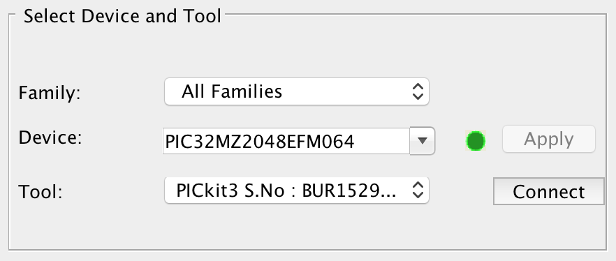
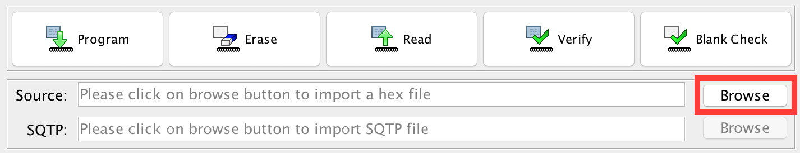
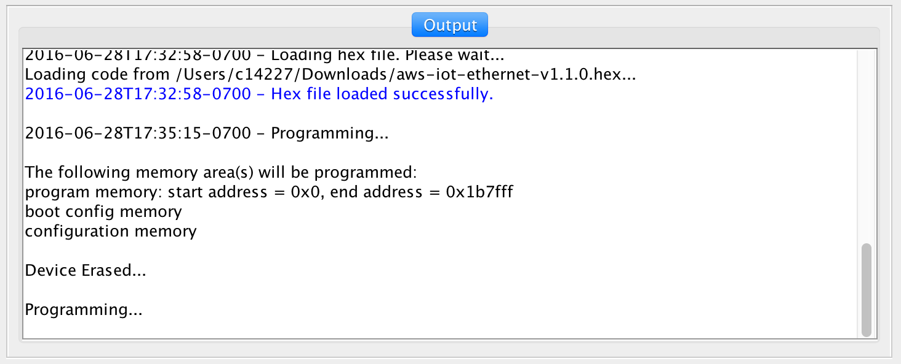
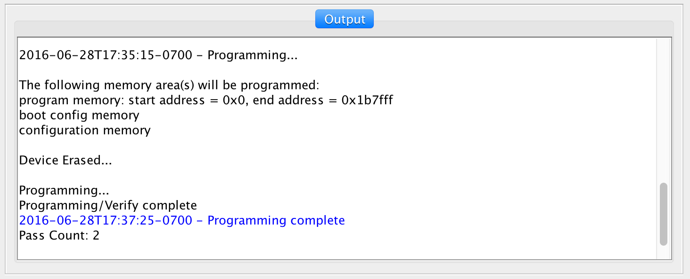

### IoT Ethernet MPLAB&reg; IPE

---

### Introduction
This document will show you where to find the latest _released_ version of the firmware HEX and how to program it into the IoT Ethernet Kit.  The MPLAB&reg; IPE allows you to directly program the HEX file of a program into the hardware.  This eliminates having to recompile a program.

More information about the MPLAB&reg; IPE can be found on [Microchip's developer help site](http://microchip.wikidot.com/ipe:start).

---

### Required Tools and Applications
#### Microchip Required Tools and Applications
You will need the following Microchip development tools to program the Microchip IoT Ethernet Kit.

- Download the latest HEX file for IoT Ethernet from here: [IoT Ethernet Project](https://github.com/MicrochipTech/aws-iot-firmware-pic32mz/releases/latest)
- Download and install Microchip MPLAB&reg; X IDE for your OS from here:
[Microchip MPLAB&reg; X IDE](http://www.microchip.com/mplabx) (3.35 tested)
- PICKit&trade; 3 In-Circuit Debugger/Programmer (or other programmer)

---

### Programming the IoT Ethernet Board using MPLAB&reg; IPE
1.  Connect your PICKIT&trade; 3 to your computer via the USB cable.
-  Connect the PICKIT&trade; 3 to the IoT Ethernet Kit ICSP header by aligning the triangles that indicate pin 1.
-  Power on the IoT Ethernet Kit.
-  Open MPLAB&reg; IPE; this can be found in the same installation folders as MPLAB&reg; X.
- We need to select which microcontroller we are using.  Begin by selecting the following
    - Select "All Families" for the "Family:" option.
    - Select "PIC32MZ2048EFM064" for the "Device:" option
    - Click the "Apply" button
- Next we need to connect to our programmer.  
    - Under "Tool:" select the PICKit&trade; 3 or other programmer.  
    - The tool should be enumerated with its serial number.
    - Click the "Connect" button

	
- The programmer will begin to connect to the IPE, it may update itself with new firmware.  This is normal.  When the programmer is fully connected you should see your target PIC32 device found as shown below.

	
- Now we need to load the HEX file into the IPE.  Click the "Browse" button next to the "Source" box.  Browse to the HEX file you downloaded and select it.

	
- Once the HEX file is loaded you will get a dialog in the output window saying "Hex file loaded successfully".
- Now we can program the board:  Click the "Program" button.

	
- The PICKit&trade; 3 will begin programming the HEX file into the board.  Please wait until it is finished.  This can take a couple minutes.

	
- Upon completion you will see a "Programming complete" in the output window.

	
- You can now begin using the board.

---

### Troubleshooting
- Target Device was not found...
  - Check that power is being provided to the board via USB and that the board's power switch is set to "USB".  The board must have power to be programmed.
- Programming failed or didn't work...
  - Try loading the HEX file into the IPE again and reprogram the board.